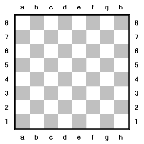

Шах
===

Полетата на шахматната дъска са номерирани по следния начин:

Едно поле на дъската се задава еднозначно чрез латинска буква от A до H и цифра от 1 до 8.

### Топ
Напишете програма, която приема като вход две позиции на шахматната дъска и проверява дали [топ](https://en.wikipedia.org/wiki/Rook_(chess)) може да стигне от едната позиция до другата в рамките на един ход.

  * За удобство приемете, че въведените позиции ще бъдат валидни.
  * На дъската няма други шахматни фигури.

### Офицер
Нека фигурата от горната задача е [офицер](https://en.wikipedia.org/wiki/Bishop_(chess)).

### Царица
Използвайте вече решените задачи за топ и офицер, за да решите задачата и за [царица](https://en.wikipedia.org/wiki/Queen_(chess)).

### Бонус
Решете задачата и за останалите шахматни фигури.